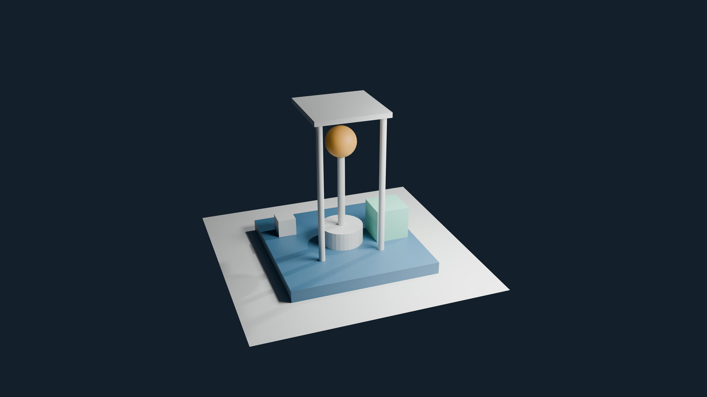

# Blender Full Tutorial Lecture 2026-2027

Project files for the **Blender Full Course** by [SECourses](https://www.youtube.com/@SECourses): 14 lectures that take you from your first Blender launch to a finished, animated short. Every lecture builds on the same project, the **Lumen Field Station**, a small stylized signal outpost with a platform, a beacon and a courier robot.

Each lecture has its own folder with the Blender files you create in the video, catch-up checkpoints for the building steps, and the rendered images.

**Watch the course on YouTube:** [Blender Full Course: 3D Modeling, Materials, Rendering & Animation (14 Lectures)](https://www.youtube.com/playlist?list=PLYUs-JVhJLWg). Start with Lecture 1: [Your First Day in Blender - Full Course, Lecture 1: Beginner 3D Tutorial](https://www.youtube.com/watch?v=Sk-4ol8IvQc).

## Lectures

| Lecture | Topic | Video | Files |
|---|---|---|---|
| 1 | Installation, Navigation & Your First 3D Scene | [Watch](https://www.youtube.com/watch?v=Sk-4ol8IvQc) | [week01](week01/) |
| 2 | Mesh Modeling, Topology, Extrude, Inset & Bevel | Planned | Planned |
| 3 | Modifiers, Curves & Modular Modeling | Planned | Planned |
| 4 | Sculpting Terrain, Rocks & Usable Topology | Planned | Planned |
| 5 | Materials, Procedural Shaders & Surface Behavior | Planned | Planned |
| 6 | UV Unwrapping, Texture Painting & Normal Baking | Planned | Planned |
| 7 | Cameras, Lighting, EEVEE, Cycles & Performance | Planned | Planned |
| 8 | Asset Libraries & Geometry Nodes Scattering | Planned | Planned |
| 9 | Procedural Modeling & Audio-Reactive Geometry Nodes | Planned | Planned |
| 10 | Robot Rigging, Weights & Constraints | Planned | Planned |
| 11 | Keyframes, Graph Editor & a 10-Second Animation | Planned | Planned |
| 12 | Cloth Simulation, Caching & Node-Based Physics | Planned | Planned |
| 13 | Compositing, Render Passes & Grease Pencil | Planned | Planned |
| 14 | Video Editing, Export, Packaging & Python Basics | Planned | Planned |

New lectures are added to the playlist and to this table as they are released.

## How to use the files

1. Install Blender from the [official download page](https://www.blender.org/download/). The course is recorded with Blender 5.2.2 LTS, so open the files with Blender 5.2 or newer.
2. Download the files: click the green **Code** button on this page and choose **Download ZIP**, or clone the repository with Git.
3. In Blender, choose **File > Open** and pick a `.blend` file.

Every lecture folder is complete on its own:

- `LumenCourse` is the project folder you build in Lecture 1, with the files that lecture creates: `blend` for the Blender files, `renders` for the saved images, and `textures`, `audio`, `cache`, `exports` and `reference` for what later lectures add. Any texture or sound a file uses is included next to it.
- `checkpoints` holds a saved scene after each building step. If you missed a step or want to start in the middle, open a checkpoint and continue the video from the time given in that lecture's README.
- The lecture's `README.md` lists every file with the video time where it is made, the checkpoints, the scene values to compare with your own, and the chapters.

The files keep the window layout of the video. To keep your own layout, open the gear menu in the **File > Open** dialog and untick **Load UI** before you open a file.

## Links

- The course playlist on YouTube: https://www.youtube.com/playlist?list=PLYUs-JVhJLWg
- Official Blender download: https://www.blender.org/download/
- Blender manual: https://docs.blender.org/manual/en/latest/
- SECourses on YouTube: https://www.youtube.com/@SECourses
- SECourses Patreon: https://www.patreon.com/SECourses
- SECourses Discord: https://discord.com/invite/software-engineering-courses-secourses-772774097734074388
