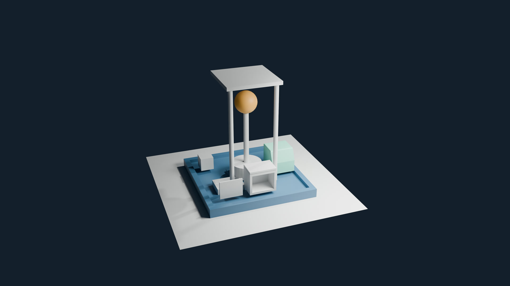

# Lecture 2: Mesh Modeling, Topology, Extrude, Inset & Bevel

Refine the Lumen Field Station from Lecture 1: recess the platform, shape the courier, build a hollow equipment housing, then reuse the same modeling decisions on a docking tray and architectural niche. Learn to select and inspect geometry, preserve wall thickness, and choose topology for the next edit.

**Video:** planned · **Lecture length:** 58:25 · [full course playlist](https://www.youtube.com/playlist?list=PLYUs-JVhJLWg) · [course overview](../README.md)

The times below refer to the completed lecture. Video links will be added when it is public.

## Files

Open the files with Blender 5.2 or newer. Start from the [finished Lecture 1 station](../week01/LumenCourse/blend/w01_station_v001.blend), then save your own numbered modeling version.

| File | What it contains | Lecture time |
|---|---|---|
| [`LumenCourse/blend/w02_modeling_v001.blend`](LumenCourse/blend/w02_modeling_v001.blend) | Working version at its last demonstrated save, after the tray and architectural niche | 2:25 created; 49:29 saved state |
| [`LumenCourse/blend/w02_station_v001.blend`](LumenCourse/blend/w02_station_v001.blend) | Completed modeling baseline for Lecture 3 | 57:39 final save |
| [`checkpoints/`](checkpoints/) | Six catch-up scenes listed below | |
| [`LumenCourse/reference/housing_front.png`](LumenCourse/reference/housing_front.png) | The image dependency used by the housing guide | 4:07 import |
| [`extras/reference/`](extras/reference/) | Front, side-section and three-quarter diagrams in PNG and editable SVG | 2:41 |
| [`extras/README.md`](extras/README.md) | Reference licenses and portable recreation instructions | |
| [`modeling_reference.md`](modeling_reference.md) | Shortcuts, dimensions and diagnostic interpretation | |
| [`LumenCourse/renders/w02_station_preview.png`](LumenCourse/renders/w02_station_preview.png) | A 3840 × 2160 companion render of the final modeled station | Companion image |

Keep the folder structure together so relative image paths resolve. To keep your own workspace layout, untick **Load UI** in the gear menu of Blender’s File > Open dialog.

## Catch-up checkpoints

Open a checkpoint, use **File > Save As** to save your own working copy, and continue at the matching time.

| Checkpoint | Scene state | Continue at |
|---|---|---|
| [`w02_checkpoint_01_selection.blend`](checkpoints/w02_checkpoint_01_selection.blend) | Component selection, Object/Edit Mode and applied scale practice. | 13:09 — Inset the platform |
| [`w02_checkpoint_02_platform.blend`](checkpoints/w02_checkpoint_02_platform.blend) | Recessed platform with its retained floor and stepped central pad. | 17:31 — Shape the courier |
| [`w02_checkpoint_03_courier.blend`](checkpoints/w02_checkpoint_03_courier.blend) | Shoulder loop, sloped front and selected-edge bevel; earlier courier backups retained. | 24:14 — Compare axis constraints |
| [`w02_checkpoint_04_housing.blend`](checkpoints/w02_checkpoint_04_housing.blend) | Connected housing, separate lid/panel and the bridge study; modeled station saved. | 35:19 — Inspect face orientation |
| [`w02_checkpoint_05_diagnostics.blend`](checkpoints/w02_checkpoint_05_diagnostics.blend) | Orientation, seam and closed-shell diagnostics completed. | 43:54 — Build the docking tray |
| [`w02_checkpoint_06_transfer.blend`](checkpoints/w02_checkpoint_06_transfer.blend) | Tray, architectural niche, Delete/Dissolve and isolation studies completed. | 54:06 — Inspect the completed forms |

## Check your scene

These values are read from the exported final station. The scene uses metric units with one Blender unit equal to one meter. Dimensions describe each object’s overall bounds; mesh edits can move geometry relative to its origin.

| Object | Collection | Location X, Y, Z (m) | Dimensions X, Y, Z (m) | Material |
|---|---|---|---|---|
| GEO_BeaconBase | STATION | 0, 0, 0.35 | 0.7, 0.7, 0.3 |  |
| GEO_BeaconPost | STATION | 0, 0, 1.1 | 0.12, 0.12, 1.2 |  |
| GEO_CargoBox | STATION | -0.8, 0.6, 0.35 | 0.3, 0.3, 0.3 |  |
| GEO_CourierBody | COURIER | 0.8, 0, 0.475 | 0.55, 0.55, 0.55 | MAT_Courier |
| GEO_DockingTray | CAMERAS_LIGHTS | -0.5, -0.35, 0.185 | 0.62, 0.45, 0.13 |  |
| GEO_EquipmentHousing | CAMERAS_LIGHTS | 0, -0.75, 0.45 | 0.6, 0.4, 0.5 |  |
| GEO_Ground | ENVIRONMENT | 0, 0, 0 | 4, 4, 0 |  |
| GEO_HousingLid | CAMERAS_LIGHTS | 0.05, -0.75, 0.73 | 0.6, 0.4, 0.04 |  |
| GEO_HousingPanel | CAMERAS_LIGHTS | -0.65, -0.9, 0.42 | 0.5, 0.035, 0.4 |  |
| GEO_Platform | STATION | 0, 0, 0.1 | 2.4, 2.4, 0.2 | MAT_Platform |
| GEO_RoofPost_L | STATION | -0.5, -0.5, 1.35 | 0.1, 0.1, 2.3 |  |
| GEO_RoofPost_R | STATION | 0.5, -0.5, 1.35 | 0.1, 0.1, 2.3 |  |
| GEO_RoofSlab | STATION | 0, 0, 2.5 | 1.2, 1.2, 0.08 |  |
| GEO_SignalHead | STATION | 0, 0, 1.95 | 0.5, 0.5, 0.5 | MAT_Signal |

Some newly added objects remain in CAMERAS_LIGHTS, the active collection when they were created. Collection membership does not change their object type.

| Object with unapplied scale | Scale X, Y, Z |
|---|---|
| GEO_HousingLid | 0.3, 0.2, 0.02 |
| GEO_HousingPanel | 0.25, 0.0175, 0.2 |
| GEO_RoofSlab | 2.1818, 2.1818, 0.1455 |

| Modeled object or study | Vertices / edges / faces | Final visibility |
|---|---|---|
| GEO_CourierBody | 20 / 36 / 18 | Visible |
| GEO_DockingTray | 16 / 28 / 14 | Visible |
| GEO_EquipmentHousing | 16 / 28 / 14 | Visible |
| GEO_Platform | 28 / 52 / 26 | Visible |
| STUDY_ArchitecturalNiche | 16 / 28 / 14 | Hidden in viewport |
| STUDY_Bridge | 8 / 12 / 5 | Hidden in viewport |
| STUDY_Dissolve | 6 / 7 / 2 | Hidden in viewport |
| STUDY_Merge | 6 / 7 / 2 | Hidden in viewport |
| STUDY_Selection | 8 / 12 / 6 | Hidden in viewport |

BACKUP and STUDIES preserve earlier shapes and separate exercises. The final file hides these in the viewport; viewport hiding is separate from render visibility. Hide those collections for rendering if you want the same clean companion preview. The Bridge study intentionally has an open underside, while the Merge and Dissolve studies are thin sheets.

| Camera or light | Values |
|---|---|
| Area | AREA; location 2, -2, 3; 500 W; size 2 m |
| Camera | Location -3.244, -9.4416, 5.7606; rotation 64.3556, -0.0001, -20.0888°; lens 35 mm |
| Light | POINT; location 4.0762, 1.0055, 5.9039; 1000 W |

| Inherited color | Hex |
|---|---|
| MAT_Courier | 83DAC2 |
| MAT_Platform | 3F6D8E |
| MAT_Signal | FFB347 |
| World | 1B2432 |

The saved scene uses EEVEE with 3840 × 2160 output at 100%. The companion preview uses Cycles and omits the hidden practice/backups; it is supplied as a reference image.

## Chapters

All 24 chapters

- 0:00 Read the starting station before changing its geometry
- 2:41 Read an original reference and align its front view
- 5:55 Select mesh components and distinguish the active element
- 9:24 Compare object coordinates with mesh coordinates and scale
- 13:09 Inset a platform rim and extrude its recessed floor
- 15:28 Build a mounting pad and repeat a known extrusion
- 17:31 Place a shoulder loop and shape the courier front
- 20:32 Compare surface normals with world transform directions
- 22:11 Bevel selected edges and preserve a pre-bevel copy
- 24:14 Read the single-axis and repeated-axis constraint cycle
- 25:31 Build the housing body and create a square cavity
- 28:05 Widen the opening while preserving the housing walls
- 31:25 Bridge matching loops and compare it with filling
- 34:21 Save the modeled station and reestablish a useful view
- 35:19 Inspect solid boundaries and surface orientation
- 37:44 Merge an intentional seam and inspect manifold boundaries
- 42:10 Choose topology from the shape and its next edit
- 43:54 Reuse inset and extrusion to build a second docking tray
- 46:37 Transfer the same construction to an architectural niche
- 49:48 Compare Delete with Dissolve on a clean disposable strip
- 52:33 Reach connected geometry with Hide and Local View
- 54:06 Inspect the completed forms from above and below
- 55:25 Preview an adjustable Bevel modifier
- 56:12 Adjust the preview and save the final station

## Links

- [Blender manual](https://docs.blender.org/manual/en/latest/)
- [Official Blender download](https://www.blender.org/download/)
- [Screencast Keys](https://github.com/nutti/Screencast-Keys), the key display shown in the lesson

Next: Lecture 3, Modifiers, Booleans, Curves, Text & Modular Modeling, continues from `LumenCourse/blend/w02_station_v001.blend`.
