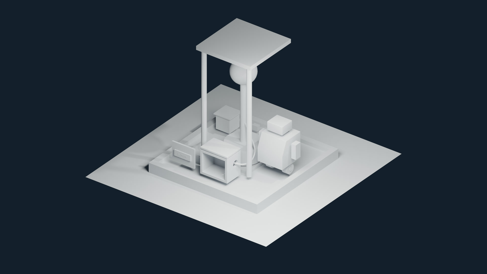

# Lecture 3 — Modifiers, curves and reversible modeling

Continue the Lumen Field Station from Lecture 2 and build geometry that remains easy to revise. Add symmetry, controlled edge treatment, a fitted cover, repeated brackets, an editable cable and text, and separate courier parts. Finish with an adjustable Boolean socket and a reopened station checkpoint.

**Video:** planned · **Lecture length:** 1:29:33 · [full course playlist](https://www.youtube.com/playlist?list=PLYUs-JVhJLWg) · [course overview](../README.md)

The times below refer to the completed lecture. Video links will be added when it is public.

## Start here

1. Download this week's folder and open extras/w03_inputs.blend. It includes the Lecture 2 station and the six supplied comparison meshes, so it matches the recording's starting state.
2. Save your own working copy as w03_modeling_v001.blend in your LumenCourse/blend folder before changing the model. The lecture later saves the construction checkpoint as w03_station_v001.blend.
3. To resume partway through the lesson, open the matching file in checkpoints and use its continuation time in the table below. Save your own copy before experimenting.

Recorded with **Blender 5.2.2 LTS**. Keep the downloaded folder structure together so relative dependencies resolve. In File > Open, turn off **Load UI** if you prefer to retain your own workspace layout.

## Files

| File | Contents | Lecture time |
|---|---|---|
| [`extras/w03_inputs.blend`](extras/w03_inputs.blend) | Lecture 2 station plus the six supplied comparison meshes; the starting state of this lecture. | 0:27 |
| [`extras/create_week03_studies.py`](extras/create_week03_studies.py) | Optional script that recreates the six comparison meshes from the Lecture 2 station. | 56:21 |
| [`extras/README.md`](extras/README.md) | Names of the comparison meshes, the tools they use, how they were created and how to hide or show them. | 56:21 |
| [`LumenCourse/blend/w03_modeling_v001.blend`](LumenCourse/blend/w03_modeling_v001.blend) | Working file saved at the start of the lecture, before the modeling changes. | 2:00 |
| [`LumenCourse/blend/w03_station_v001.blend`](LumenCourse/blend/w03_station_v001.blend) | Reopened, revised and saved station for Lecture 4. | 1:29:24 — final save |
| [`LumenCourse/blend/w03_recovery.blend`](LumenCourse/blend/w03_recovery.blend) | Saved recovery copy, including comparison geometry and original shell backups. | 1:27:28 |
| [`preview.jpg`](preview.jpg) | Untextured render of the completed station. | Companion render, shown in the closing chapter |
| [`extras/courier_modifier_stack.png`](extras/courier_modifier_stack.png) | Viewport image of the final editable courier-body modifier stack. | 1:25:30 |
| [`modeling_reference.md`](modeling_reference.md) | Operations, inspection checks and exact final modifier/curve settings | All chapters |

## Catch-up checkpoints

Open a checkpoint, save your own copy and continue at the matching chapter.

| Checkpoint | Scene state | Continue at |
|---|---|---|
| [`w03_checkpoint_01_modifier_order.blend`](checkpoints/w03_checkpoint_01_modifier_order.blend) | Mirror, edge treatment, shading comparison and stack order. | 15:14 |
| [`w03_checkpoint_02_repetition.blend`](checkpoints/w03_checkpoint_02_repetition.blend) | Solidify, current Array, fixed-pivot transform order and shared mesh data. | 30:46 |
| [`w03_checkpoint_03_subdivision.blend`](checkpoints/w03_checkpoint_03_subdivision.blend) | Control mesh, support topology, creases, n-gon and pole comparisons. | 37:02 |
| [`w03_checkpoint_04_cable.blend`](checkpoints/w03_checkpoint_04_cable.blend) | Editable curve points, handles, bevel depth, resolution and routing. | 43:30 |
| [`w03_checkpoint_05_text_and_deformation.blend`](checkpoints/w03_checkpoint_05_text_and_deformation.blend) | Snapping controls, editable text and separate deformation study. | 56:21 |
| [`w03_checkpoint_06_courier_assembly.blend`](checkpoints/w03_checkpoint_06_courier_assembly.blend) | Separate rigid parts, contact, clearance and individual-origin pivot comparison. | 1:13:30 |
| [`w03_checkpoint_07_boolean.blend`](checkpoints/w03_checkpoint_07_boolean.blend) | Editable cutter, Difference and downstream Bevel. | 1:21:33 |

## Construction choices

- An object's origin, local axes and scale affect how transforms and modifiers behave. Inspect them before choosing a symmetry plane, distance or pivot.
- Modifier order determines the geometry received by the next operation. Compare the source mesh, evaluated silhouette and shading separately.
- Keep the station's useful controls editable: Mirror, Bevel, Array, Solidify, curves, text and the Boolean cutter. Use separate studies for comparisons that should not replace the production geometry.
- A linked duplicate shares mesh data; an independent duplicate does not. A separate object can still share its geometry with another object. Inspect this distinction before editing a variation.
- Keep rigid courier parts separate and put their origins where later movement will make sense. Inspect contact and clearance from more than one view.
- A Boolean cutter needs a closed volume with outward-facing normals. Inspect the actual opening after Difference; a visible wire outline alone does not prove that the wall was cut.
- An endpoint position and its tangent work together. Align the cable's outgoing handle through the socket, then inspect the opening and surrounding clearance from another view.

## Check the exported final scene

These values were read from the exported `w03_station_v001.blend`. Units: METRIC, unit scale 1. Locations are object origins; dimensions are evaluated object bounds. The tables describe the saved final revision.

| Object | Collection | Location X, Y, Z | Dimensions X, Y, Z | Scale X, Y, Z | Material |
|---|---|---|---|---|---|
| CR_arm_L | COLLECTION_COURIER | 0.44, 0, 0.88 | 0.1, 0.14, 0.3 | 1, 1, 1 |  |
| CR_arm_R | COLLECTION_COURIER | 1.16, 0, 0.88 | 0.1, 0.14, 0.3 | 1, 1, 1 |  |
| CR_axle | COLLECTION_COURIER | 0.8, 0, 0.3 | 0.07, 0.07, 0.5 | 1, 1, 1 |  |
| CR_body | COLLECTION_COURIER | 0.8, 0, 0.695 | 0.55, 0.55, 0.55 | 1, 1, 1 | MAT_Courier |
| CR_chassis | COLLECTION_COURIER | 0.8, 0, 0.4 | 0.2, 0.1, 0.2 | 1, 1, 1 |  |
| CR_foot_L | COLLECTION_COURIER | 0.62, 0, 0.3 | 0.2, 0.2, 0.12 | 1, 1, 1 |  |
| CR_foot_R | COLLECTION_COURIER | 0.98, 0, 0.3 | 0.2, 0.2, 0.12 | 1, 1, 1 |  |
| CR_head | COLLECTION_COURIER | 0.8, 0, 1.12 | 0.34, 0.3, 0.18 | 1, 1, 1 |  |
| CR_neck | COLLECTION_COURIER | 0.8, 0, 0.99 | 0.11, 0.11, 0.08 | 1, 1, 1 |  |
| GEO_BeaconBase | STATION | 0, 0, 0.35 | 0.7, 0.7, 0.3 | 1, 1, 1 |  |
| GEO_BeaconPost | STATION | 0, 0, 1.1 | 0.12, 0.12, 1.2 | 1, 1, 1 |  |
| GEO_BracketSource | CAMERAS_LIGHTS | -0.6, 0.85, 0.25 | 0.84, 0.08, 0.1 | 1, 1, 1 |  |
| GEO_CargoBox | STATION | -0.8, 0.6, 0.35 | 0.3, 0.3, 0.3 | 1, 1, 1 |  |
| GEO_CargoCover | CAMERAS_LIGHTS | -0.8, 0.6, 0.52 | 0.36, 0.36, 0.02 | 1, 1, 1 |  |
| GEO_DockingTray | CAMERAS_LIGHTS | -0.5, -0.35, 0.185 | 0.62, 0.45, 0.13 | 1, 1, 1 |  |
| GEO_EquipmentHousing | CAMERAS_LIGHTS | 0, -0.75, 0.45 | 0.6, 0.4, 0.5 | 1, 1, 1 |  |
| GEO_Ground | ENVIRONMENT | 0, 0, 0 | 4, 4, 0 | 1, 1, 1 |  |
| GEO_HousingLid | CAMERAS_LIGHTS | 0.05, -0.75, 0.73 | 0.6, 0.4, 0.04 | 1, 1, 1 |  |
| GEO_HousingPanel | CAMERAS_LIGHTS | -0.65, -0.9, 0.42 | 0.5, 0.035, 0.4 | 0.25, 0.0175, 0.2 |  |
| GEO_Nameplate | CAMERAS_LIGHTS | -0.65, -0.9175, 0.42 | 0.36, 0.024, 0.12 | 1, 1, 1 |  |
| GEO_Platform | STATION | 0, 0, 0.1 | 2.4, 2.4, 0.2 | 1, 1, 1 | MAT_Platform |
| GEO_RoofPost_L | STATION | -0.5, -0.5, 1.35 | 0.1, 0.1, 2.3 | 1, 1, 1 |  |
| GEO_RoofPost_R | STATION | 0.5, -0.5, 1.35 | 0.1, 0.1, 2.3 | 1, 1, 1 |  |
| GEO_RoofSlab | STATION | 0, 0, 2.5 | 1.2, 1.2, 0.08 | 2.1818, 2.1818, 0.1455 |  |
| GEO_SignalHead | STATION | 0, 0, 1.95 | 0.5, 0.5, 0.5 | 1, 1, 1 | MAT_Signal |
| GEO_StationCable | CAMERAS_LIGHTS | 0, 0, 0 | 0.4225, 0.7087, 0.4884 | 1, 1, 1 |  |
| TXT_StationLabel | CAMERAS_LIGHTS | -0.65, -0.9425, 0.42 | 0.1867, 0.0415, 0.002 | 1, 1, 1 |  |

Comparison objects and original shell backups are hidden when they are not being used. Reveal only the object needed for a comparison. Local View temporarily isolates selected geometry; viewport hiding and render visibility remain separate controls.

| Camera or light | Saved values |
|---|---|
| Area | AREA; location 2, -2, 3; 500 W; size 2 m |
| Camera | Location -3.244, -9.4416, 5.7606; rotation 64.3556, -0.0001, -20.0888 degrees; lens 35 mm |
| Light | POINT; location 4.0762, 1.0055, 5.9039; 1000 W |

| Inherited material color | sRGB hex |
|---|---|
| MAT_Courier | #83DAC2 |
| MAT_Platform | #3F6D8E |
| MAT_Signal | #FFB347 |
| World background | #1B2432 |

Saved render engine: **BLENDER_EEVEE**. Output: **3840 × 2160 at 100%**. The supplied full-resolution companion preview is a local render of the same final geometry, provided for inspection.

## Practice

- Predict the result before reversing two modifiers or changing the order of a translation and rotation. Compare the result with the prediction, then restore the intended construction.
- Make a wider courier variation by editing the source geometry. Check the center seam, bevel width, shoulder gaps and wheel clearance afterward.
- Change the bracket count and compare relative spacing with a fixed offset. Observe which measurements depend on the source width.
- Move or resize the socket cutter and inspect the downstream bevel. Save, reopen the file, and verify that the same controls remain editable.

## Chapters

All 26 chapters

- 0:00 Revise the courier without changing the platform
- 2:16 Place the origin before building symmetry
- 5:12 Keep a source half and close the mirror seam
- 7:28 Distinguish object movement from mesh movement
- 8:56 Give a bevel a predictable physical size
- 10:54 Separate smooth shading from actual geometry
- 13:12 Read modifier order from top to bottom
- 15:14 Give an open cover adjustable thickness
- 18:41 Repeat a bracket with the current Array modifier
- 21:52 Explore a circular arrangement on a separate copy
- 23:24 Predict transform order around a fixed pivot
- 27:41 Choose independent or linked mesh duplicates
- 30:46 Inspect subdivision before adding more topology
- 33:16 Compare creases, flat faces and uneven poles
- 37:02 Save the editable construction and clear the view
- 38:28 Route a cable with editable curve points
- 43:30 Choose a snapping base and target before placement
- 46:55 Use increment snapping and understand the Ctrl toggle
- 48:42 Keep the station label as editable text
- 52:16 Compare proportional editing with a deformation modifier
- 56:21 Shape loops with Blender native mesh tools
- 1:00:24 Build separate courier parts with useful clearance
- 1:11:05 Choose a pivot for a multi-part transform
- 1:13:30 Build an editable Boolean socket for the cable
- 1:21:33 Predict and test a dimensional revision
- 1:25:30 Inspect contributions and reopen the editable result

## Assets and links

The supplied comparison meshes and their creation script are original course assets. The ready-to-use input file is sufficient for following the lecture; running the script is optional. Text uses Blender's bundled font, and the demonstrated modeling tools do not require an extension installation.

- [Lecture 1](../week01/) and [Lecture 2](../week02/)
- [Blender manual](https://docs.blender.org/manual/en/latest/)
- [Screencast Keys](https://github.com/nutti/Screencast-Keys), the key display shown in the lecture

Keep the final station file as the starting point for Lecture 4's terrain work.
