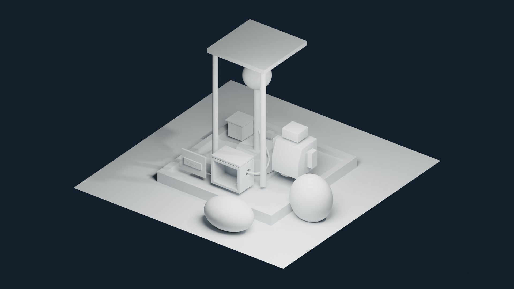

# Lecture 4 — Sculpting, organic form and retopology

Continue the Lumen Field Station with sculpted terrain and a rock pair. Compare brush behavior and mesh resolution, protect regions with masks, preserve aligned low/high baking meshes, and build local quad patches for a rock and an independent character study.

**Video:** planned · **Lecture length:** 1:10:44 · [full course playlist](https://www.youtube.com/playlist?list=PLYUs-JVhJLWg) · [course overview](../README.md)

Times refer to the completed lecture. Watch links will be added when the video is public.

## Start here

1. Open `extras/w04_inputs.blend`, which contains the accepted Lecture 3 station and the supplied blank practice meshes.
2. Save a working copy before sculpting. Keep the downloaded folder structure together; your drive letter can differ.
3. Use the checkpoints below to resume a demonstration, and read the [concept guide](LECTURE_04_GUIDE.md) for inspection questions.

Recorded with **Blender 5.2.2 LTS**, the local Essentials brush assets and a mouse. No paid brush pack or graphics tablet is required. Turn off **Load UI** in File > Open if you want to preserve your own interface layout.

## Files

| File | Purpose | Shown at |
|---|---|---|
| [`extras/w04_inputs.blend`](extras/w04_inputs.blend) | Lecture 3 station with original blank sculpt and topology practice inputs. | 2:54 |
| [`extras/w04_opening.blend`](extras/w04_opening.blend) | Primary, secondary and tertiary form comparison shown in the opening. | 0:00 |
| [`extras/create_week04_studies.py`](extras/create_week04_studies.py) | Optional script for recreating the supplied practice meshes from the Lecture 3 station. | 2:54 |
| [`extras/README.md`](extras/README.md) | Practice-mesh license and free Essentials brush route. | 2:54 |
| [`LECTURE_04_GUIDE.md`](LECTURE_04_GUIDE.md) | Concepts, numeric settings, shortcuts, checkpoints and comparison questions. | 0:00 |
| [`LumenCourse/blend/w04_station_v001.blend`](LumenCourse/blend/w04_station_v001.blend) | Working copy of the station before sculpting. | 3:22 |
| [`LumenCourse/blend/w04_terrain_v001.blend`](LumenCourse/blend/w04_terrain_v001.blend) | Sculpted terrain before the mesh-resolution studies. | 10:37 |
| [`LumenCourse/blend/w04_rock_low_v001.blend`](LumenCourse/blend/w04_rock_low_v001.blend) | Broad rock form with ridge and recess, before high-detail work. | 25:34 |
| [`LumenCourse/blend/w04_rock_masked_v001.blend`](LumenCourse/blend/w04_rock_masked_v001.blend) | Protected-form checkpoint after masking, hidden geometry and face sets. | 33:18 |
| [`LumenCourse/blend/w04_bake_pair_v001.blend`](LumenCourse/blend/w04_bake_pair_v001.blend) | Aligned low receiver and detailed high source for later baking. | 39:11 |
| [`LumenCourse/blend/w04_retopology_v001.blend`](LumenCourse/blend/w04_retopology_v001.blend) | Local quad patch with a Shrinkwrap target and inspected offset. | 51:50 |
| [`LumenCourse/blend/w04_head_blockout_v001.blend`](LumenCourse/blend/w04_head_blockout_v001.blend) | Independent coarse head blockout, ready for the eyelid study. | 57:23 |
| [`LumenCourse/blend/w04_head_eyelid_neutral_v001.blend`](LumenCourse/blend/w04_head_eyelid_neutral_v001.blend) | Neutral head and eyelid strip preserved for the later shape-key lesson. | 1:03:03 |
| [`LumenCourse/blend/w04_station_v002.blend`](LumenCourse/blend/w04_station_v002.blend) | Saved and reopened final station for the Lecture 5 continuation. | 1:07:29 |
| [`extras/w04_bake_low_inspection.png`](extras/w04_bake_low_inspection.png) | Full-resolution low receiver in the same view as the high source. | 38:28 |
| [`extras/w04_bake_pair_inspection.png`](extras/w04_bake_pair_inspection.png) | Full-resolution high source showing two interior grooves and unchanged alignment. | 38:57 |
| [`LumenCourse/renders/w04_station_preview.png`](LumenCourse/renders/w04_station_preview.png) | Full-resolution neutral companion render from the accepted final checkpoint. | Companion render |
| [`extras/w04_silhouette.png`](extras/w04_silhouette.png) | Full-resolution camera composition inspection from the final station. | 1:08:34 |

## Catch-up checkpoints

Save your own copy before continuing. The time is the next narration unit after the checkpoint state.

| Checkpoint | State | Continue at |
|---|---|---|
| [`checkpoints/w04_checkpoint_01_terrain.blend`](checkpoints/w04_checkpoint_01_terrain.blend) | Completed terrain checkpoint. | 10:53 |
| [`checkpoints/w04_checkpoint_02_resolution.blend`](checkpoints/w04_checkpoint_02_resolution.blend) | Voxel, dynamic topology and Multires comparison endpoint. | 20:02 |
| [`checkpoints/w04_checkpoint_03_rock_placement.blend`](checkpoints/w04_checkpoint_03_rock_placement.blend) | Second-rock placement with platform clearance. | 27:54 |
| [`checkpoints/w04_checkpoint_04_masking.blend`](checkpoints/w04_checkpoint_04_masking.blend) | Mask, hide and face-set checkpoint. | 33:35 |
| [`checkpoints/w04_checkpoint_05_bake_pair.blend`](checkpoints/w04_checkpoint_05_bake_pair.blend) | Aligned bake source and receiver, deliberately excluded from the station render. | 39:42 |
| [`checkpoints/w04_checkpoint_06_sculpt_additions.blend`](checkpoints/w04_checkpoint_06_sculpt_additions.blend) | Add Primitives, Scene Project and attribute-remesh studies. | 47:56 |
| [`checkpoints/w04_checkpoint_07_retopology.blend`](checkpoints/w04_checkpoint_07_retopology.blend) | Projected local quad patch. | 52:35 |
| [`checkpoints/w04_checkpoint_08_head.blend`](checkpoints/w04_checkpoint_08_head.blend) | Independent head blockout. | 57:39 |
| [`checkpoints/w04_checkpoint_09_neutral_eyelid.blend`](checkpoints/w04_checkpoint_09_neutral_eyelid.blend) | Neutral eyelid for the later deformation study. | 1:03:20 |
| [`checkpoints/w04_checkpoint_10_station.blend`](checkpoints/w04_checkpoint_10_station.blend) | Final station continuation. | 1:10:44 |

## Inspect the saved scene

The following values were read from exported `w04_station_v002.blend`. Units: METRIC; unit scale 1. Locations are object origins and dimensions are evaluated bounds.

| Object | Collection | Location X, Y, Z | Dimensions X, Y, Z | Scale X, Y, Z | Material |
|---|---|---|---|---|---|
| CR_arm_L | COLLECTION_COURIER | 0.44, 0, 0.88 | 0.1, 0.14, 0.3 | 1, 1, 1 |  |
| CR_arm_R | COLLECTION_COURIER | 1.16, 0, 0.88 | 0.1, 0.14, 0.3 | 1, 1, 1 |  |
| CR_axle | COLLECTION_COURIER | 0.8, 0, 0.3 | 0.07, 0.07, 0.5 | 1, 1, 1 |  |
| CR_body | COLLECTION_COURIER | 0.8, 0, 0.695 | 0.55, 0.55, 0.55 | 1, 1, 1 | MAT_Courier |
| CR_chassis | COLLECTION_COURIER | 0.8, 0, 0.4 | 0.2, 0.1, 0.2 | 1, 1, 1 |  |
| CR_foot_L | COLLECTION_COURIER | 0.62, 0, 0.3 | 0.2, 0.2, 0.12 | 1, 1, 1 |  |
| CR_foot_R | COLLECTION_COURIER | 0.98, 0, 0.3 | 0.2, 0.2, 0.12 | 1, 1, 1 |  |
| CR_head | COLLECTION_COURIER | 0.8, 0, 1.12 | 0.34, 0.3, 0.18 | 1, 1, 1 |  |
| CR_neck | COLLECTION_COURIER | 0.8, 0, 0.99 | 0.11, 0.11, 0.08 | 1, 1, 1 |  |
| GEO_BeaconBase | STATION | 0, 0, 0.35 | 0.7, 0.7, 0.3 | 1, 1, 1 |  |
| GEO_BeaconPost | STATION | 0, 0, 1.1 | 0.12, 0.12, 1.2 | 1, 1, 1 |  |
| GEO_BracketSource | CAMERAS_LIGHTS | -0.6, 0.85, 0.25 | 0.84, 0.08, 0.1 | 1, 1, 1 |  |
| GEO_CargoBox | STATION | -0.8, 0.6, 0.35 | 0.3, 0.3, 0.3 | 1, 1, 1 |  |
| GEO_CargoCover | CAMERAS_LIGHTS | -0.8, 0.6, 0.52 | 0.36, 0.36, 0.02 | 1, 1, 1 |  |
| GEO_DockingTray | CAMERAS_LIGHTS | -0.5, -0.35, 0.185 | 0.62, 0.45, 0.13 | 1, 1, 1 |  |
| GEO_EquipmentHousing | CAMERAS_LIGHTS | 0, -0.75, 0.45 | 0.6, 0.4, 0.5 | 1, 1, 1 |  |
| GEO_Ground | ENVIRONMENT | 0, 0, 0 | 4, 4, 0 | 1, 1, 1 |  |
| GEO_HousingLid | CAMERAS_LIGHTS | 0.05, -0.75, 0.73 | 0.6, 0.4, 0.04 | 1, 1, 1 |  |
| GEO_HousingPanel | CAMERAS_LIGHTS | -0.65, -0.9, 0.42 | 0.5, 0.035, 0.4 | 0.25, 0.0175, 0.2 |  |
| GEO_Nameplate | CAMERAS_LIGHTS | -0.65, -0.9175, 0.42 | 0.36, 0.024, 0.12 | 1, 1, 1 |  |
| GEO_Platform | STATION | 0, 0, 0.1 | 2.4, 2.4, 0.2 | 1, 1, 1 | MAT_Platform |
| GEO_Rock | W04_INPUTS | 1.55, -0.55, 0.36 | 0.7789, 0.6631, 0.86 | 1, 1, 1 | W04_Stone_Clay |
| GEO_Rock_Second | W04_INPUTS | 0.65, -1.65, 0.26 | 0.9346, 0.6631, 0.559 | 1, 1, 1 | W04_Stone_Clay |
| GEO_RoofPost_L | STATION | -0.5, -0.5, 1.35 | 0.1, 0.1, 2.3 | 1, 1, 1 |  |
| GEO_RoofPost_R | STATION | 0.5, -0.5, 1.35 | 0.1, 0.1, 2.3 | 1, 1, 1 |  |
| GEO_RoofSlab | STATION | 0, 0, 2.5 | 1.2, 1.2, 0.08 | 2.1818, 2.1818, 0.1455 |  |
| GEO_SignalHead | STATION | 0, 0, 1.95 | 0.5, 0.5, 0.5 | 1, 1, 1 | MAT_Signal |
| GEO_StationCable | CAMERAS_LIGHTS | 0, 0, 0 | 0.4225, 0.7087, 0.4884 | 1, 1, 1 |  |
| GEO_Terrain | W04_INPUTS | 0, 0, 0.002 | 4.4, 4.4, 0.0419 | 1, 1, 1 | W04_Terrain_Clay |
| TXT_StationLabel | CAMERAS_LIGHTS | -0.65, -0.9425, 0.42 | 0.1867, 0.0415, 0.002 | 1, 1, 1 |  |

The bake source, bake receiver and practice collections remain excluded from the station render. Reveal the needed study for inspection; viewport and render visibility are separate controls.

| Study object | Vertices / edges / faces | Purpose |
|---|---|---|
| BAKE_rock_high | 2562 / 7680 / 5120 | Aligned detailed source for Lecture 6 |
| BAKE_rock_low | 642 / 1920 / 1280 | Aligned receiver for Lecture 6 |
| RETOPO_Eyelid_Neutral | 10 / 13 / 4 | Connected neutral quad strip for Lecture 10 |
| RETOPO_RockPatch | 9 / 12 / 4 | Local Shrinkwrap quad exercise |
| STUDY_MaleHead | 10242 / 30720 / 20480 | Independent coarse head blockout |

| Camera or light | Saved settings |
|---|---|
| Area | AREA; location 2, -2, 3; 500 W |
| Camera | Location -3.244, -9.4416, 5.7606; rotation 64.3556, -0.0001, -20.0888 degrees; lens 35 mm |
| Light | POINT; location 4.0762, 1.0055, 5.9039; 1000 W |

| Material | Base color, sRGB hex |
|---|---|
| MAT_Courier | #83DAC2 |
| MAT_Platform | #3F6D8E |
| MAT_Signal | #FFB347 |
| W04_Head_Clay | #998473 |
| W04_Stone_Clay | #819399 |
| W04_Terrain_Clay | #738479 |
| World | #1B2432 |

Saved render engine: **BLENDER_EEVEE**. Output: **3840 × 2160 at 100%**. The companion preview renders the accepted geometry with neutral inspection shading and a view that includes the sculpted additions.

## Practice

- Compare the main silhouette at a small size before adding detail.
- Keep the docking footprint useful, and inspect rock placement from above and through the camera.
- Explain what voxel remesh, dynamic topology and Multires preserve before choosing one.
- Switch visibility to compare the aligned bake pair; do not save them moved apart.
- Check the neutral eyelid from front and side views before adding a shape key in the later lecture.

## Chapters

- 0:00 Read primary form before adding surface detail
- 3:08 Save the station and inspect the terrain footprint
- 5:24 Choose a brush and control its first stroke
- 8:38 Smooth deliberately and check the docking clearance
- 10:53 Remesh a copy and compare the cost of resolution
- 15:04 Read local density and a preserved subdivision hierarchy
- 20:02 Establish the rock silhouette and broad planes
- 23:14 Add a ridge and recess while keeping quiet areas
- 25:51 Make a second silhouette and inspect the composition
- 27:54 Protect the base and make an intentional asymmetry
- 31:01 Distinguish masking, hidden geometry and face sets
- 33:35 Preserve the low receiver and its aligned high copy
- 36:32 Add high detail and compare without moving the pair
- 39:42 Add a starting primitive inside Sculpt Mode
- 41:57 Project a sheet toward a nearby supporting surface
- 45:34 Inspect color attributes before and after a voxel remesh
- 47:56 Build and project a small quad patch over the rock
- 52:35 Block a stylized male head from simple forms
- 57:39 Construct a neutral eyelid strip for later motion
- 1:03:20 Return to the station and compare material roughness
- 1:07:10 Save, reopen and identify the next task

## Assets and continuation

The supplied practice meshes and optional creation script are original CC0 materials; see [extras/README.md](extras/README.md). The scene continues from [Lecture 3](../week03/). The key display shown in the video is [Screencast Keys](https://github.com/nutti/Screencast-Keys); it is not bundled.

Next: materials and surface behavior in Lecture 5. Keep the aligned bake pair for Lecture 6 and the neutral head/eyelid study for Lecture 10.
